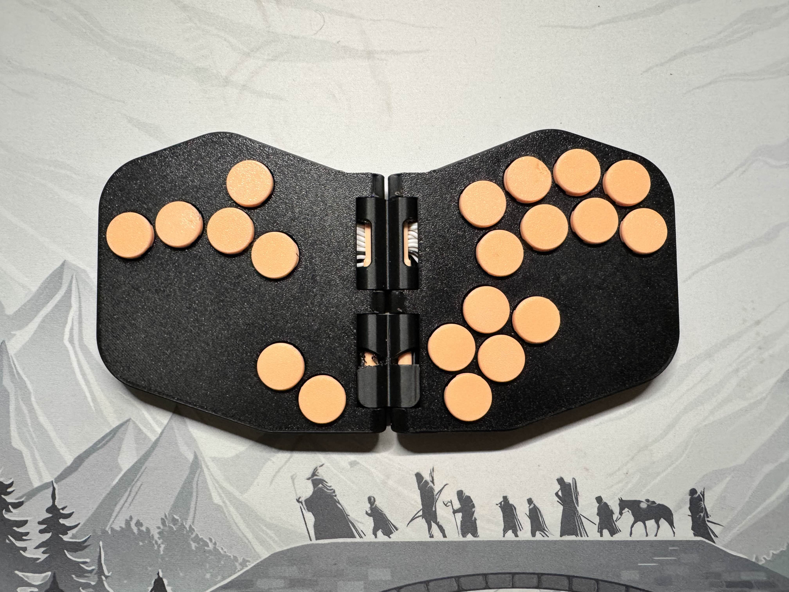
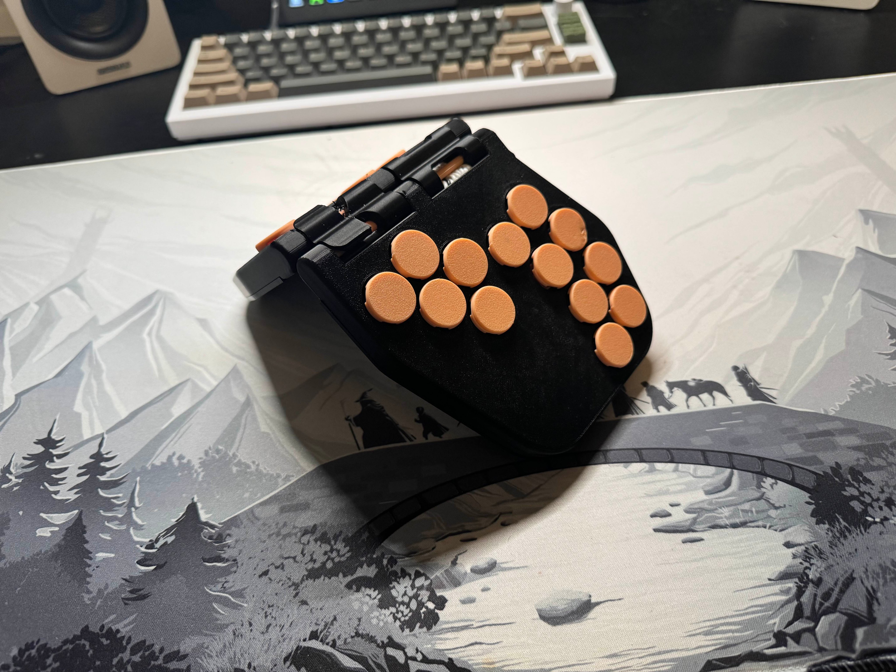

# The Rana Labs Moth (WASD Version)

My version of [Rana Labs'](https://github.com/rana-sylvatica) Moth, a foldable leverless controller.

    
    

  
<h4>What's changed from the original?</h4>

- Added the WASD up button, sunk some of the shell under the WASD cluster to add mounting points for the Pico.
- Removed a modifier button and moved them to be more comfortable to use.
- Changed the USB-C port location to accommodate for WASD, fitted for ModelUD.
- Enlarged the hinge rounded edges to provide a more secure friction fit for when you want to play in 'prism' mode.
- Added a lip to the hinge to lock in the desired prism angle.
- Changed thickness of the hinge pin holes to have a tighter friction fit.
- Changed magnet hole size to accommodate larger magnets that could snap the controller firmly together.
- Filleted the edges of the controller to give it a nice rounded feel.

  

---

## Shell Prints

I printed the entire shell, hinges, etc., in **Bambu Lab PETG**, though any PETG or PLA should work. I printed the hinge pin with **PLA+**, as PETG would warp without supports.

- **Microcontroller:** Standard Pico, screws in with any **M2 screws** (4mm length, but shorter would work).
- **Switches:** Must be **low profile switches**. I used **Cosmox Wind Engines** and a couple **Gateron KS33 Silvers**.
- **USB-C Connector:** [Model UD](https://github.com/HTangl/Model-UD) (superglued in), but I recommend using **ModelBirdD** for mounting with screws. You'll need to modify the model slightly to fit ModelBirdD.

---

## Assembly Instructions

1. **Pico Side:**
   - Wire up the **Pico side completely** first.
   - Then, individually run the wires from the opposite side one by one.
   - **Important:** Do this while the Moth is in the **folded position!**

2. **Wiring Tips:**
   - If not folded while soldering cross-body wires, they might be pulled too tightly when folding.
   - Leave **decent slack** for cross-body wiring.
   - Pass wires behind the hinge pin for neatness.

3. **Hinge Pin Placement:**
   - Insert the hinge pin **before** wiring the cross-body connections.
   - Attempting to run wires before inserting the hinge pin can make installation difficult, the wires will block the pin from going through.

---

## Magnets

Strong magnets are crucial, as they have to counteract every single spring in your switches. I used:

- **6x2mm Neodymium magnets**, stacked **3 high** in each of the **10 total holes** (30 total magnets).
- These create a satisfying snap and keep the Moth securely folded.

**Amazon link:** [Magnets used](https://a.co/d/aDkEUHX)

---

## 'Prism' Ergonomic Mode

For the reverse folded position:

- A **lip** on the top hinge piece prevents overfolding, creating a stopping point.
- Hinges have a rounded back that creates friction, providing rigidity while playing in the ergonomic 'prism' setup.

### Adjustments:

- You can edit the hinge lip's width to adjust the folding angle.
- Recommended change: **Move the lip from the top hinge to the bottom hinge**, because:
  - The top hinge cannot be removed without complete rewiring.
  - The bottom hinge allows for hinge pin removal, making angle changes easier.

---

## Miscellaneous Notes

- **Button Fit:** Ensure buttons sit flush with the face surface when depressed to allow proper folding.
- **Magnet Strength:** Strong neodymium magnets may overcome minor protrusions but aim for flush alignment.
- **Hinge Pin Slot:** You can add caps for a cleaner look, but friction fit holds securely without them.
